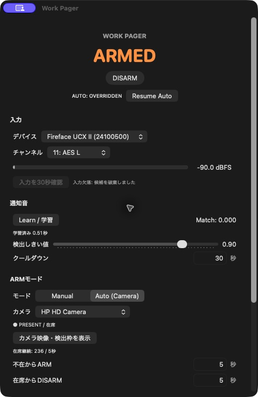
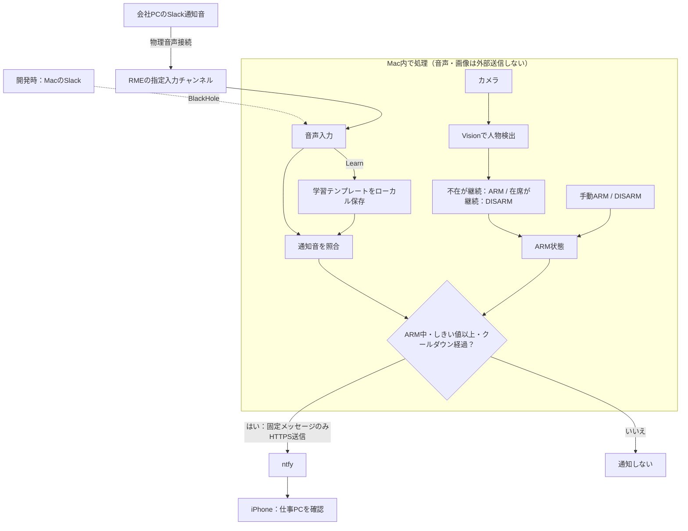

# Work Pager

Swift / SwiftUIのmacOS向け通知音ページャーです。選択した音声入力で学習済みの通知音を検出し、ARM中だけntfyへ「仕事PCを確認」を送ります。

## アプリ画面



実機での表示例です。デバイス・チャンネル・判定時間は撮影時の設定で、初期値とは異なります。`AUTO: OVERRIDDEN`は手動操作が優先されている状態です。画面内の「入力欠落」は、音声バッファの欠落を検知して候補を破棄した診断表示です。カメラ映像・秘密topicの値は掲載していません。

## 動作概要



- **音声**：指定チャンネルの通知音を学習し、その音との一致度で検出します。DISARM中の音声入力は停止し、学習・入力確認時だけ一時的に開きます。
- **カメラ**：初期値は不在30秒でARM、在席5秒でDISARM。画面内の人物を対象にし、本人の識別は行いません。
- **手動操作**：Auto中にARM/DISARMを操作すると自動制御を一時停止し、`Resume Auto`で再開します。
- **外部通信**：送信するのは固定のタイトル`Work Pager`と本文`仕事PCを確認`だけです。音声・カメラ画像・Slack本文は送信しません。

## ビルド・起動

macOS 14以降、Swift 6対応Xcode。外部パッケージ依存はありません。

```sh
./scripts/build-app.sh
open "dist/Work Pager.app"
```

`Package.swift`をXcodeで開いて編集できます。権限説明を含むアプリバンドルで動作確認するには上記スクリプトを使用してください。ローカル用のad-hoc署名です。再ビルドによってmacOSの権限やKeychain許可を再確認される場合があります。

## 使い方

1. 入力デバイスとチャンネルを選択します。「入力を30秒確認」でメーターを確認できます。macOSの既定入力は変更しません。
2. 「Learn / 学習」を押し、15秒以内にSlack通知音を1回再生します。学習中はDISARMになり、Autoはoverrideされます。静かな状態で通知音だけを鳴らしてください。
3. ntfyのHTTPSサーバーを確認し、「ランダム生成・保存」で秘密topicを作ります。既存topicも入力して保存できます。
4. 「topicをコピー」で取得したtopicをiPhoneのntfyアプリで同じサーバーに購読し、「Send Test Notification」で受信を確認します。HTTP 200はサーバー受付の表示であり、iPhone受信の証明ではありません。
5. ManualでARM、またはAuto (Camera)を選びます。Autoは初期値で不在30秒後にARM、在席5秒後にDISARMです。数値は変更できます。
6. Auto中のARM/DISARM操作は自動制御を一時停止します。「Resume Auto」で判定時間をリセットして再開します。
7. 業務終了時はアプリを終了します。起動時のARM状態は常にDISARMです。Autoモード選択は保存されます。

## 入力と学習

AUHALで特定のCore Audioデバイスを直接開き、全入力チャンネルから指定チャンネルを処理します。デバイスUIDを保存し、表示名や一時的なAudioDeviceIDに依存しません。RME以外のBlackHole等も利用できます。

入力はFloat32、機器のサンプルレートで取得し、ワーカーで12 kHzモノラルに変換します。100 msの事前音声、220 msの無音判定、最大4秒のイベント抽出を行い、正規化相互相関で比較します。無音時は照合しません。学習は次に入った一定以上の音を対象にするため、別の音を鳴らすとそれを学習します。

DISARM中は音声入力を停止します。明示的な30秒入力確認と学習中だけ一時的に入力を開きます。入力欠落時は候補を破棄し、接続停止時はDISARMしてエラーを表示します。入力変更やDISARMの前に取得した音声イベントは通知に使いません。

## カメラ

AVFoundation + Visionで約2回/秒、上半身の人物検出を実行します。顔認証や個人識別はしません。キーボード・マウス等の補助信号は利用しません。在席状態が反転すると判定時間をリセットします。

カメラ未接続・権限拒否・フレーム停止時はARM状態を保持し、Manualへ切り替えて理由を表示します。暗さ、画角、遮蔽物で判定が変わるので実際の机で確認してください。

## 保存と通信

- 一般設定: UserDefaults (`local.WorkPager`)
- 秘密topic: macOS Keychain (`local.WorkPager` / `ntfy-topic`)
- 学習音: `~/Library/Application Support/WorkPager/reference.json`（ローカルのみ、ファイル権限600）
- カメラ: フレームは保存せず、Vision処理後に破棄
- 通信: URLSessionで固定のタイトル `Work Pager` と本文 `仕事PCを確認` のみPOST
- HTTPSのみ。リダイレクト・Cookie・キャッシュは使用しません。音声、カメラ画像、Slack情報を通信処理に渡すAPIはありません。
- 失敗時に無限再試行しません。ネットワークエラーに含まれ得る秘密URLは画面に表示しません。

## 開発テスト

```sh
swift test
# このMacで学習した実音も使う場合:
WORKPAGER_REFERENCE="$HOME/Library/Application Support/WorkPager/reference.json" swift test -c release
```

合成波形のゲイン・極性・遅延・雑音、別音・無音の除外、バッファ境界、リサンプル、presenceの遅延・override・resume、ARMとcooldown、ntfy送信データの境界、テンプレート保存を検証します。任意の実音テストではmacOSの14種のシステム音との照合も行います。音声ファイルはリポジトリに含めません。

## 本番経路

開発用BlackHoleの学習結果で会社PCの実経路を検証したことにはなりません。会社PC → 物理音声 → RMEの実際の入力チャンネルでLearnを行い、iPhone受信と誤検出を確認してから常用してください。

詳細な実施結果は `VALIDATION.md` に記録します。

## カメラ検出デバッグ

ARMモード欄の「カメラ映像・検出枠を表示」で別窓を開きます。Auto (Camera)中の実際の解析フレームに、人物の検出枠・信頼度・在席判定の対象人数を重ねます。緑枠は信頼度50%以上で在席判定の対象、黄色枠はしきい値未満です。枠の人物番号はフレーム内だけの番号で、人物識別・追跡IDではありません。

現状は画面全体を対象にするため、奥のソファにいる家族も在席判定の対象になり得ます。この窓では判定の対象範囲を確認できます（判定範囲の限定や本人の識別は行いません）。

映像は左右反転なし、約2回/秒で枠と同じフレームを表示します。デバッグ窓を開いている間のみ表示用の最新1枚をメモリに保持し、閉じる・Manualへ切り替える・カメラ変更・エラー時に破棄します。更新が3秒途切れた映像は表示しません。画像ファイルへの保存・録画・ネットワーク送信はありません。

## アプリアイコン

`Assets/AppIcon.png`が生成したアイコンの原本です。`scripts/build-icon.sh`で16〜1024pxのmacOS用ICNSへ変換し、通常のアプリビルドで自動的にバンドルへ組み込みます。
